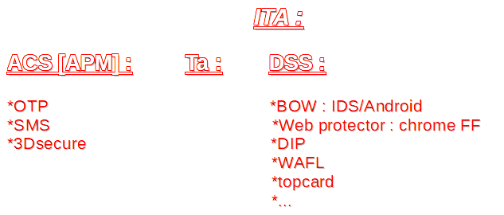

# suivi de stage chez worldline

## Lundi :

* L'entreprise est née a Blois et a fait une collaboration avec une entreprise situer a Lille et ont former Atos. Puis elle a pris son indépendance et a commencer à s'ettaler dans le monde pour devenir Worldline  le 4ᵉ acteur mondial
  des paiements en ligne. Et le premier en Europe.
* J'ai été accuelli dans un service nommé GRS.
* J'ai écrit un programme en java
* J'ai manger dans le restaurants de l'entreprise puis j'ai jouer au jeux video.
* J'ai vue la vie d'un pc d'en l'entreprise; le système résaux; les serveur de l'entreprise(ça fait un bruit pas possible)
* j'ai continuer mon programme puis je suis parti

## MARDI :

### boitier bull :

#### cryptographie :

### dev c :

Utilise le language c qui n'est pas très utiliser. Il est
en relation presque directe avec l'ordinateur.  
Le poste consiste à amméliorrer des programme des années 2000 pour les truc
ou ont paie a la caisse.

### developement dans le cloud :

### github 
Github est une sorte d'entrepôts ou on peut stoker ces codes et ou on peux les 
modifier sur n'importe quels appareils.
Pour enregistrer les modifications il faut commit and push.
Appuyer sur le petit rond avec une ligne genre le métro londonien.
