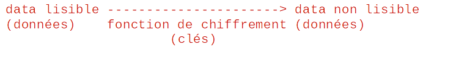
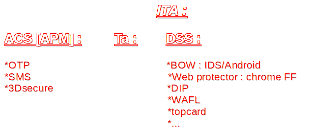

# suivi de stage chez worldline

🎺

## Lundi :

* L'entreprise est née a Blois et a fait une collaboration avec une entreprise situer a 
Lille et ont former Atos. Puis elle a pris son indépendance et a commencer à s'ettaler dans
le monde pour devenir Worldline le 4ᵉ acteur mondial des paiements en ligne. Et le premier 
en Europe.
* J'ai été accuelli dans un service nommé GRS.
* J'ai écrit un programme en java
* J'ai manger dans le restaurants de l'entreprise puis j'ai jouer au jeux video.
* J'ai vue la vie d'un pc d'en l'entreprise; le système résaux; les serveur de l'entreprise
(ça fait un bruit pas possible)
* j'ai continuer mon programme puis je suis parti

## MARDI :

### boitier bull :

#### cryptographie :

### dev c :

Utilise le language c qui n'est pas très utilisé. Il est
en relation presque directe avec l'ordinateur.  
Le poste consiste à améliorer des programmes des années 2000 pour les trucs
où on paie a la caisse.

### Developement dans le cloud :

### github 
Github est une sorte d'entrepôts ou on peut stoker ces codes et ou on peux les 
modifier sur n'importe quels appareils.
Pour enregistrer les modifications il faut commit and push.
Appuyer sur le petit rond avec une ligne genre le métro londonien.

## MERCREDI

### performance et monitoring d'une application
Ça consiste à gerer une application et a voire jusqu'où l'application peux aller comme par 
exemple jusqu'a combien de donnée une application peut recevoir en même temps 
ex: pour des paris en ligne.

### architecture internet
Organisation d'un projet sur internet.

###  La sécurité 
Trouver des failles de sécurité pour les boucher pour éviter toute intrusion malveillante.

### L'environnement
On a calculer notre empreinte carbone à quatre, on a eu 10 tonne de co2 par ans
(perso c'est entre 6.5 et 7)